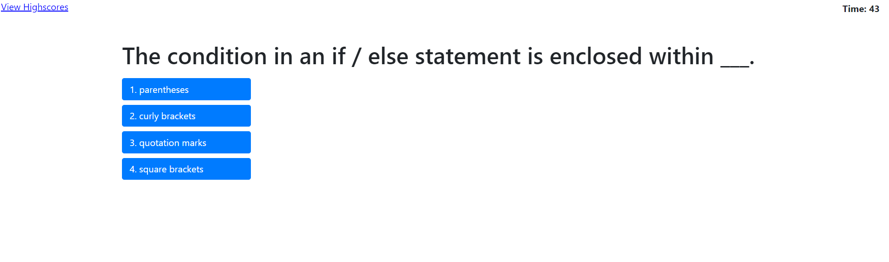
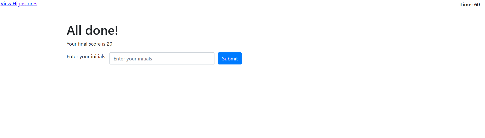

In this repository I created a simple JavaScript quiz. In this application, the user is asked five JavaScript-related questions, and has 60 seconds the answer them. At the end of the quiz, the user enters their initials, and their score is stored in the "Highscores" page. I used JavaScript to manipulate the DOM and make the page dynamic. I used local storage to store new scores and display them to the "Highscores" page.

[Here is a link to the application.](https://ethanl150.github.io/JavaScriptQuiz/)

